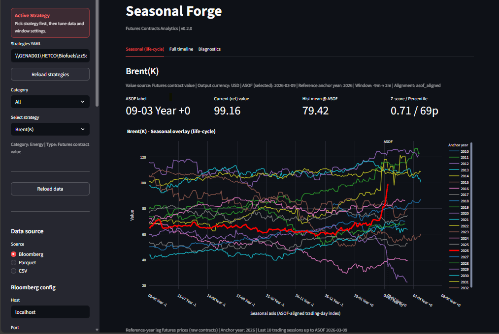
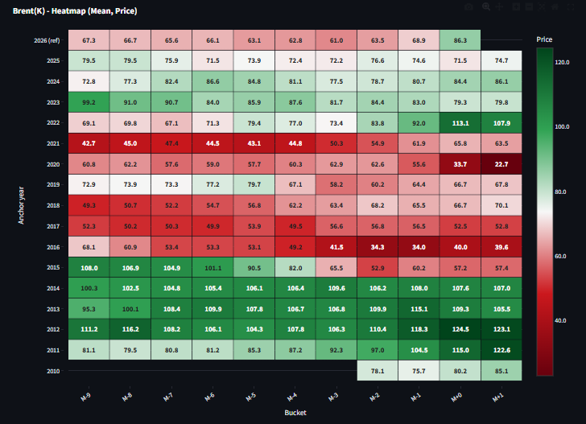
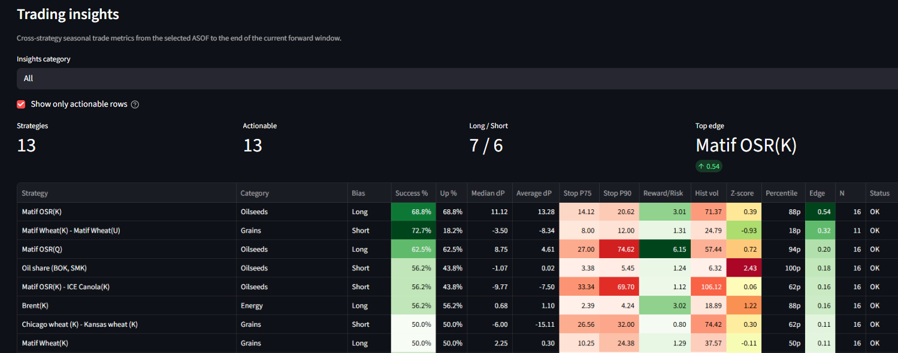

# Seasonal Forge

Seaonal Forge is a Bloomberg Terminal-first **commodity futures seasonality** workbench with forged lifecycle overlays, heatmaps, and multi-leg spread analytics. CSV and Parquet inputs are supported as fallbacks.

## Highlights

- Primary feed: Bloomberg (`blpapi`) with local cache and live snapshot refresh
- Seasonal lifecycle overlay around ASOF (`-m` to `+m` window)
- Seasonal heatmap with month or month-decade buckets
- Trading insights table with hit rate, expected move, statistical stop bands, z-score, and volatility
- Multi-leg spreads with FX/UoM normalization and optional expressions
- Modular architecture for adding new providers and visuals
- *Trading Insights* tab showing trading metrics

## Quick start

```bash
pip install -r requirements.txt
streamlit run app.py
```

## Screenshots

- `docs/screenshots/seasonal_overlay.png`
- `docs/screenshots/seasonal_heatmap.png`
- `docs/screenshots/trading_insights.png`






## Strategy YAML

Strategies live in [`strategies.yaml`](strategies.yaml).

Required/important fields per strategy:

- `name`
- `category`
- `output_currency`
- `min_obs`
- `value_source`: `contract` or `calculated`
- `legs`
- `expression` (optional, usually with `value_source: calculated`)

Example:

```yaml
- name: "Oil share (BOK, SMK)"
  category: "Oilseeds"
  output_currency: "USD"
  min_obs: 5
  value_source: "calculated"
  expression: "100 * BO / (BO + SM)"
  legs:
    - alias: "BO"
      ticker_root: "BO"
      month_code: "K"
      multiplier: 1
      year_shift: 0
      uom_mul: 0.11
      currency: "USD"
      fx_ticker: null
    - alias: "SM"
      ticker_root: "SM"
      month_code: "K"
      multiplier: 1
      year_shift: 0
      uom_mul: 0.022
      currency: "USD"
      fx_ticker: null
```

`value_source` is displayed in the UI so users can distinguish direct contract series from computed strategies.

## Versioning

Version is managed in [`pyproject.toml`](pyproject.toml) under `[project].version`.
The app header reads this value at runtime, so bumping that field is enough for releases.

## Tests

```bash
python -m unittest discover -s tests -v
```

## Project layout

- `app.py`: Streamlit UI and orchestration
- `engine.py`: contract parsing, spread/expression construction, lifecycle alignment
- `data_provider.py`: source abstraction and Bloomberg/file loading
- `bbg.py`: Bloomberg API wrapper
- `ui_components.py`: plotting and table helpers
- `tests/`: unit test suite
